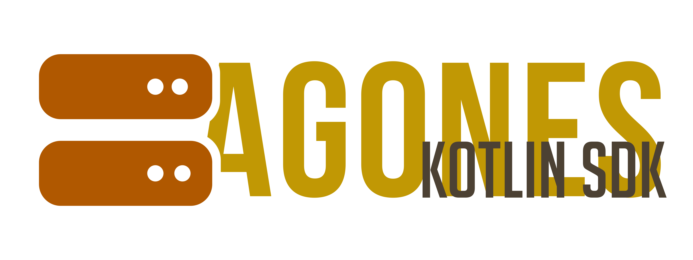

[](https://sonarcloud.io/summary/new_code?id=scrayosnet_agones-kotlin-sdk "Coverage")
[](https://sonarcloud.io/summary/new_code?id=scrayosnet_agones-kotlin-sdk "Reliability")
[](https://sonarcloud.io/summary/new_code?id=scrayosnet_agones-kotlin-sdk "Maintainability")
[](https://sonarcloud.io/summary/new_code?id=scrayosnet_agones-kotlin-sdk "Security")

Agones Kotlin SDK is a [gRPC][grpc-docs] client/binding that wraps the raw protobuf stubs and communication with
[Agones][agones-project] SDK. The Agones Client SDK provides the interface for lifecycle management, metadata and player
tracking of the individual GameServer instances within Agones. The different interfaces need to be used in order to
inform the controller of Agones about the current state of this instance. Each instance has its own endpoint for the
receiving of API calls (gRPC and REST), that is launched next to the container of the instance within the same pod. The
client SDK stays in contact with that Endpoint throughout the whole lifetime of the instance.

We needed to implement our own Agones Client SDK because there is no official SDK and the existing alternatives are all
sparsely documented (at best) and some mandatory methods from the SDK specification are missing. Therefore, we started
implementing our own solution on-top of the Protobuf definitions that Agones already provides. We'll try to update the
Agones mappings every time that there is an API change.

## Major Features

* **Full gRPC Integration** – Communicates directly with the Agones sidecar via gRPC.
* **Lifecycle Management** – Easily mark GameServers as ready, allocated, reserved, or shutdown.
* **Metadata Support** – Set and retrieve GameServer labels and annotations.
* **Player Tracking** – Report player connections and manage player capacity.
* **Counts and Lists** – Complete support for the Counters and Lists API.
* **Customizable gRPC Runtime** – Use any compatible gRPC transport (Netty, Netty-shaded, …).
* **Actively Maintained & Tested** – CI with test coverage, SonarCloud quality metrics.
* **Fully Typed Kotlin/Java API** – Clean, idiomatic Kotlin interfaces and types.

## Getting started

In order to use this SDK, your application needs to have access to the sidecar container of [Agones][agones-project] and
this instance needs to have [gRPC][grpc-docs] enabled. These are both the default scenarios, so you should be good to
go and need no further setup.

### Dependency

After your instance is up and running, you have to add Agones Kotlin SDK to your dependencies:

```kotlin
dependencies {
    // make sure to specify the latest version
    api("net.scrayos", "agones-kotlin-sdk", "5.1.0-SNAPSHOT")

    // choose your own gRPC runtime or use an existing one
    runtimeOnly("io.grpc", "grpc-netty", "1.72.0")
}
```

Instead of `grpc-netty` you may also use `grpc-netty-shaded` (which hides the transitive Netty dependency) or any other
compatible gRPC runtime. We recommend sticking with the default runtime but in theory, Agones SDK should be compatible
with either runtime.

Since the Agones SDK is deployed to the official Maven Central repository, you don't need to include any special
repositories:

```kotlin
repositories {
    mavenCentral()
}
```

After reloading your Gradle project, you should now be able to retrieve all related classes.

### Usage

Below you can find a guide on obtaining an `AgonesSdk`, the central interface to perform operations through the
[Agones][agones-project] SDK. Please use the version, appropriate for your language (Java/Kotlin).

#### Kotlin

```kotlin
// host and port are supplied by the default environment variables
val sdk = GrpcAgonesSdk()

// any request can be performed on the sdk while it is open
sdk.ready()
```

#### Java

```java
// host and port are supplied by the default environment variables
AgonesSdk sdk = new GrpcAgonesSdk();

// any request can be performed on the sdk while it is open
sdk.

ready();
```

## Reporting Security Issues

To report a security issue for this project, please note our [Security Policy][security-policy].

## Code of Conduct

Participation in this project comes under the [Contributor Covenant Code of Conduct][code-of-conduct].

## How to contribute

Thanks for considering contributing to this project! In order to submit a Pull Request, please read
our [contributing][contributing-guide] guide. This project is in active development, and we're always happy to receive
new contributions!

## License

This project is developed and distributed under the MIT License. See [this explanation][mit-license-doc] for a rundown
on what that means.


[grpc-docs]: https://grpc.io/

[agones-project]: https://agones.dev/
